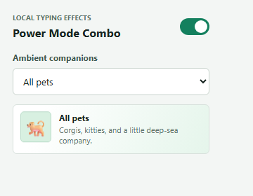
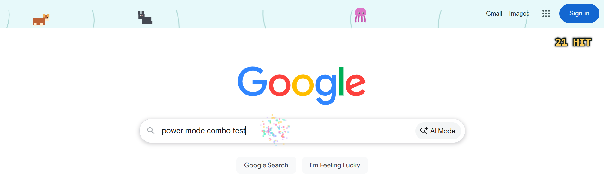

# Developer Power Mode Combo

A local-only Chrome Manifest V3 extension that counts trusted keyboard edits in text fields and draws lightweight combo effects and pixel-art pets. It has no build step, dependencies, telemetry, or network requests. Typed content, page URLs, and browsing metadata are never saved or transmitted.

## Files

Keep the extension files together in one folder, for example:

```text
my-power-mode-ext/
  manifest.json
  popup.html
  popup.js
  typing-rules.js
  content.js
  styles.css
  README.md
  test/
    typing-rules.test.js
  screenshots/
    popup.png
    octopus.png
    corgis-kitties.png
    kitties.png
    google-combo.png
    pet-modes.gif
```

`styles.css` is the isolated content-script stylesheet for the canvas. Popup presentation is inline in `popup.html`, so no page-facing popup rules are injected into host websites. `typing-rules.js` holds the keyboard/input classification shared by the content script and tests. The screenshots and GIF show locally rendered popup states.

## Preview




Additional captures: [Octopus](screenshots/octopus.png), [Corgis & Kitties](screenshots/corgis-kitties.png), and [Kitties](screenshots/kitties.png).

### Google.com Input Smoke Test



The capture shows `power mode combo test` typed into Google's search field and the resulting `21 HIT` counter. The local test harness ran the repository's production content scripts and stylesheet in Microsoft Edge, with only `chrome.storage` mocked. This verifies the editor-event and overlay behavior, but not Chrome's **Load unpacked** installation flow; the search was not submitted.

## Install in Chrome

1. Keep `manifest.json`, `popup.html`, `popup.js`, `typing-rules.js`, `content.js`, and `styles.css` directly in the same folder. Keep the `test/` and `screenshots/` folders beside them.
2. Open `chrome://extensions` in Chrome.
3. Turn on **Developer mode**.
4. Select **Load unpacked** and choose the project root folder containing `manifest.json` (not `test/` or `screenshots/`).
5. Visit or reload an `http://` or `https://` page, then select the extension icon to choose the pet mode and toggle Power Mode.

When changing extension files, return to `chrome://extensions`, press the extension's reload button, and reload the page being tested. Chrome does not allow extensions to run on some restricted pages, including `chrome://` pages and the Chrome Web Store.

## Focused Tests

The keyboard and input-type filters have focused tests using Node's built-in test runner; no npm packages are required. From the project root, run:

```sh
node --test test/typing-rules.test.js
```

The tests cover printable/edit keys, shortcuts and navigation exclusions, IME composition and synthetic-event filtering, AltGraph characters, and paste/drop/cut exclusions.

## Behavior

- Preferences are stored locally under one `chrome.storage.local` key. No keystrokes or page details are stored.
- Only trusted keyboard-driven text insertion, deletion, replacement, and composition commits in text inputs, textareas, and explicit `contenteditable="true"` regions count. Password fields, paste, shortcuts, navigation, and script-driven value changes are ignored.
- Focus changes between editors reset the combo; 1.5 seconds without a valid edit resets it as well.
- At 3 hits the overlay displays a counter and emits limited particles; every 10 hits adds a brief shake on the overlay canvas only.
- Ambient pets stay within the first 60 CSS pixels of the page viewport. Octopus modes add a translucent water band and capped ink blots.
- Rendering uses a single animation-frame loop capped near 30 FPS, pauses in hidden tabs, and respects reduced-motion preferences. The canvas is pointer-transparent and capped at 8 million backing pixels.

The extension asks for local storage and access to ordinary HTTP/HTTPS pages solely to store these preferences and run the local content script. It makes no external requests.